#KORUZA User Guide

- [Koruza Mounting](#Koruza-Mounting)
- [Koruza Power up](#Power-up)

##Koruza Mounting 

**Step 1:** Prepare KORUZA unit in the aluminium enclosure.

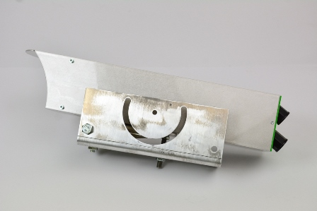

**Step 2:** Take the antenna holder set (M-E4) and unscrew three M8 nuts with washers.

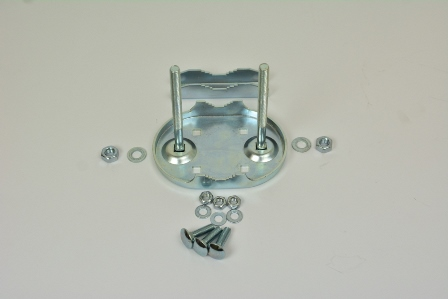

**Step 3:** Put upper right screw trough the holder and into the hole on L-profile.  Place other two screws in upper left and bottom right hole in the holder and pull them trough the oval opening on the L-profile.

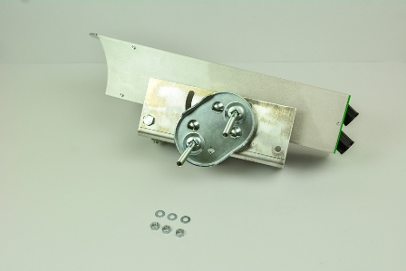

**Step 4:** Put a nut on each screw.

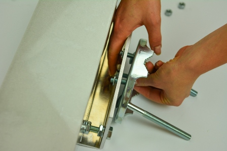

**Step 5:** Screw the antenna holder to the L-profile with M8 nuts, but do not tighten them fully. 

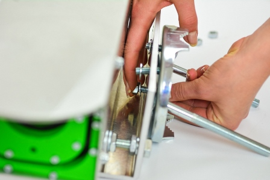

**Step 6:** Before tightening nuts, keep in mind the mounting pole can be oriented horizontaly or vertically. You can adjust the position by rotating the mount in the U slot on L-profile, depending on orientation of pole.

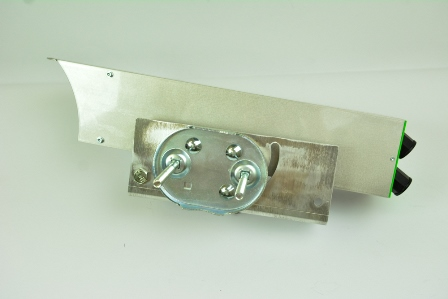
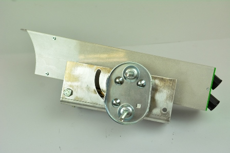

**Step 7:** Once the mount is in the desired position tighten the screws. 

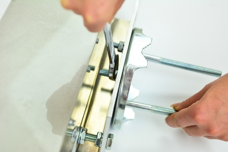

**Step 8:** Now unit can be mounted on a pole (minimum diameter of pole 30mm, maximum 70mm).

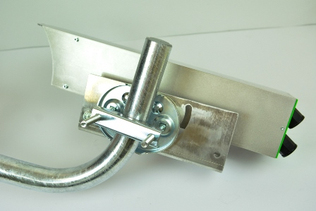

**Step 9:** Put a washer on each screw.

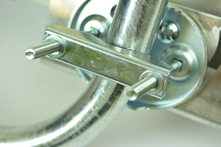

**Step 10:** Tighten the nuts. 

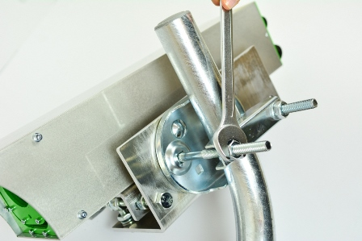

**Step 11:** Similarity, you can mount the unit on a horizontal pole. 

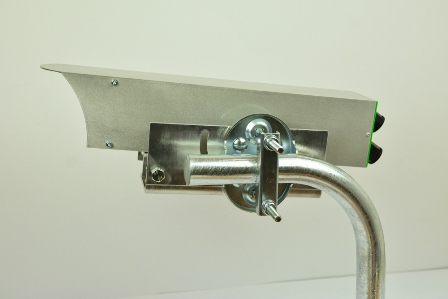

**Step 12:** For fine alignment of Koruza in horizontal direction move nuts on both sides of L profile on 160 mm M8 bolt. 

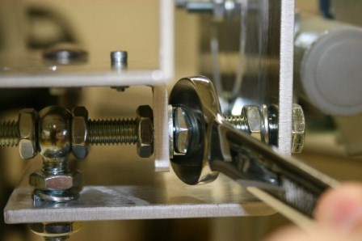
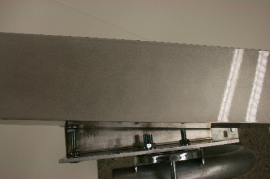

**Step 13:** For fine alignment of Koruza in vertical direction move two nuts on bottom surface of L-profile.

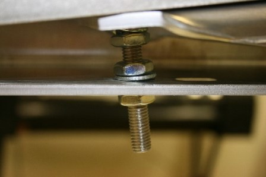
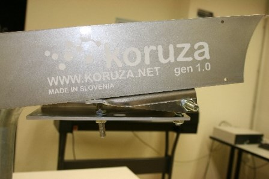

##Koruza Power up 

**Step 14:** Connect KORUZA units to the network and power. Connect management 100Mbps ethernet port (top one) to the PoE port of the PoE injector and connect LAN port to your local network. Koruza acquires a DHCP lease from the network and the management interface can be accessed via http://<name of koruza>.local or the IP address allocated of it. The default name of the unit is koruza and thus accessible via http://koruza.local.

**Step 15:** Connect KORUZA data port 1Gbps (bottom one) to your network. Note once the wireless link is established, the two networks you are connecting will be bridged.

**Step 16:** Make sure units are powered up by observing a blinking light on the back cover of each KORUZA unit. Now the task is to aim the two KORUZA units at eachother.

**Step 17:** Access KORUZA web interface http://name of koruza.local or the IP address allocated to it. Note that your computer must be connected to the same network as KORUZA management interface.

**Step 18:** On KORUZA web interface choose Login and use default username: `pi` and password: `raspberry`.

**Step 19:** Under section *Motor status* enable `Green laser enabled` and the green pointing laser will turn on. Use the M10 nuts as shown in steps 12 and 13 to aim the green laser at the opposite unit. At 100m distance you should be able to get it within 50cm of the unit, but align as accurately as possible.

**Step 20:** Repeat the process on the other unit.

**Step 21:** Use the motorized alignment to fine-tune the alignment untill you see under section *SFP status* the value of `RX power` rise above 5dB, the optimal value being above 20dB. Motorized alignment is performed with *wasd* keys, *w=up , a=right, d=left, s=down*, but making sure the `Keyboard motor control enabled` is on. The slider position determines how fine the step of each keystroke is. At 100m use the slider position in the lower third.

**Step 22:** Repeat the process on the opposite unit.

**Step 23:** If both units receive above 20dB of RX optical power, then the process is complete. Otherwise repeat stepo 19-21.

___

